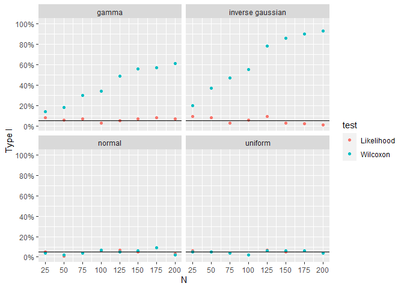
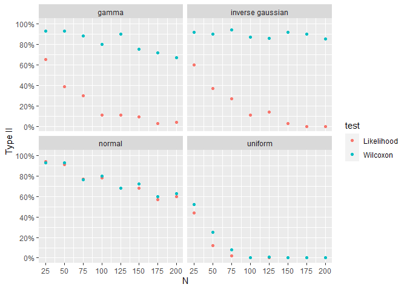

## Which nonparametric test for mu is best?

There are two nonparametric tests for mu. Which test is best? Is one
test better in some situations and the other test better in another
situation? This repo compares the two hypothesis tests with data from
four different distributions.

Tests:

- Empirical Likelihood
- Wilcoxon Rank Sum

Distributions:

- Gaussian
- Gamma
- Uniform
- Inverse Gaussian

The main outcome is the empirical likelihood test is superior to the
Wilcoxon test.

## Experimental Design

In this experiment, two settings vary. N goes from 25 to 200 increasing
by 25. The distribution changes between normal, gamma, uniform and
inverse gaussian. Each combination is repeated 100 times. Per row, the
two test receive the exact same data and have the exact same null
hypothesis.

The first few simulations look like

    # A tibble: 3,200 × 5
       dist      n iteration   LR_P  WIL_P
       <chr> <dbl>     <int>  <dbl>  <dbl>
     1 gamma    25         1 0.0389 0.0588
     2 gamma    25         2 0.874  0.367 
     3 gamma    25         3 0.682  0.560 
     4 gamma    25         4 0.666  0.164 
     5 gamma    25         5 0.370  0.895 
     6 gamma    25         6 0.657  0.792 
     7 gamma    25         7 0.144  0.0551
     8 gamma    25         8 0.0541 0.634 
     9 gamma    25         9 0.663  0.252 
    10 gamma    25        10 0.533  0.191 
    # ℹ 3,190 more rows

## Type I Error

Each combination of N and distribution is aggregated to calculate type I
error.

For symmetrical distributions, the two tests perform similarly. For
asymmetrical distributions, the Wilcoxon test is far from the target 5%
type I error. Surprisingly, it performs worse as sample size increases.
For the inverse gaussian distribution, it approaches nearly 100% type I
error. Symmetry is a critical assumption of the Wilcoxon test.

For all four distributions, the empirical likelihood test achieves the
target 5% error and has nearly identical type I error rates when the
Wilcoxon test’s assumptions are true.

## Type II Error

For type II error, the simulation is repeated. The major change is the
null hypothesis is false. Each combination of N and distribution is
aggregated to calculate type II error. Note the effect size is only .25.

For symmetrical distributions, type II error is similar for the two
tests. For asymmetrical distributions, the empirical likelihood is
better. For the inverse gaussian distribution, the Wilcoxon test’s type
II error does not appear to decrease with increases in sample size.

